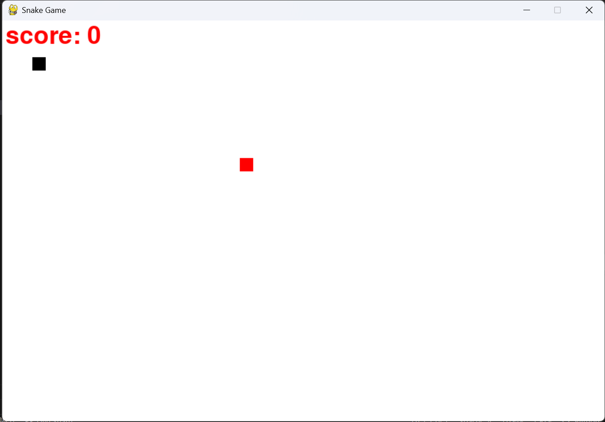
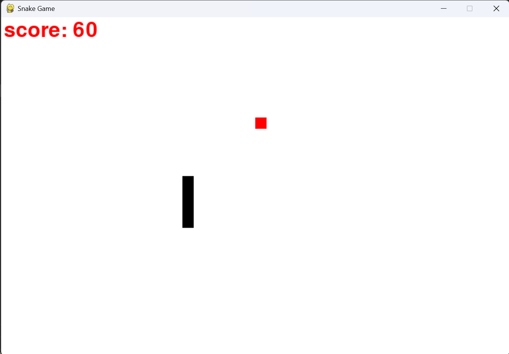
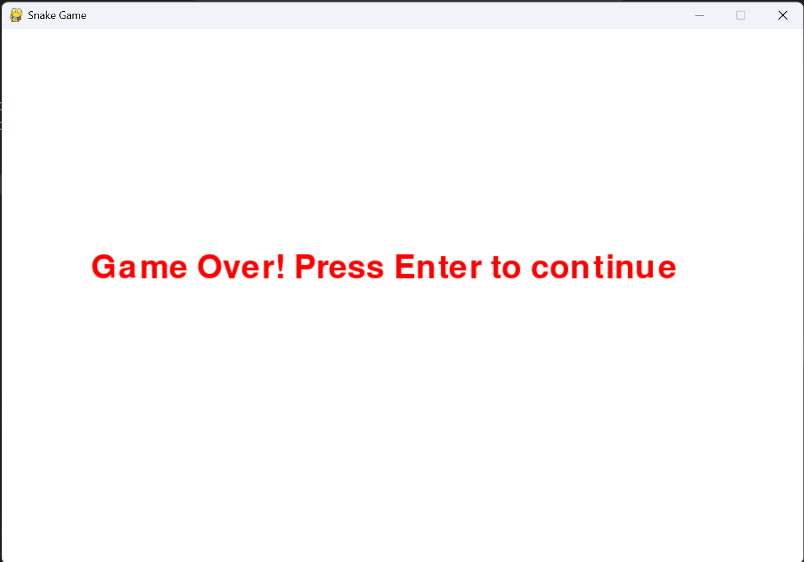

# Python Snake Game

A simple Snake Game built using Python and the `pygame` and `random` libraries. This project includes two variations of the classic Snake Game, showcasing slight differences in gameplay mechanics.

## Features

- **Classic Snake Game:** Navigate the snake to collect food and grow longer.
- **Scoring system:** For better engagement.
- **Two Game Modes:**
  - **`main.py`:** The snake cannot pass through walls.
  - **`main2.py`:** The snake can wrap around the screen edges.
- **Randomized Food Placement:** Food appears at random positions on the grid.

## Project Structure

```
├── main.py        # Snake game where the snake cannot pass through walls
├── main2.py       # Snake game with screen wrapping functionality
├── assets/        # (Optional) Directory for images, sounds, etc.
└── README.md      # Project documentation
```

## How to Run the Project

### Prerequisites

Ensure you have Python installed on your system. You also need the `pygame` library, which can be installed via pip:

```bash
pip install pygame
```

### Running the Game

1. Clone the repository:
   ```bash
   git clone https://github.com/prakashdebroy/snakegame.git
   ```

2. Navigate to the project directory:
   ```bash
   cd snake-game
   ```

3. Run one of the game modes:
   - To play the version without wall wrapping:
     ```bash
     python main.py
     ```
   - To play the version with wall wrapping:
     ```bash
     python main2.py
     ```

## Screenshots


*Example gameplay screenshot.*


*Example gameplay screenshot.*


*Example gameplay screenshot.*

## Controls

- **Arrow Keys:** Move the snake (Up, Down, Left, Right)

## Future Improvements

- Implement levels with increasing difficulty.
- Introduce sound effects and background music.
- Add a high-score leaderboard.

## Contributions

Contributions are welcome! Feel free to fork the repository and submit pull requests with new features or improvements.
